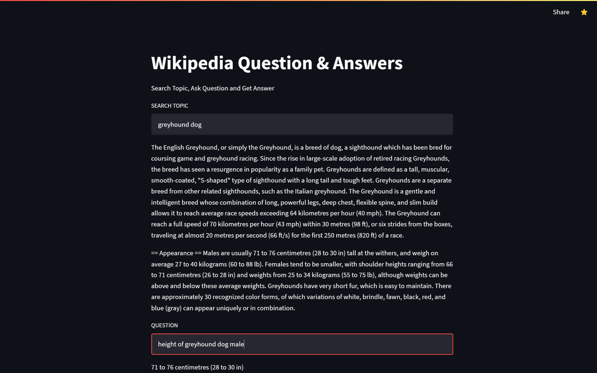

# Wikipedia summary and questioning based on the data 

> A webapp to Search Topic, Ask Question and Get Answer

Go to hosted webpage on [Streamlit](https://share.streamlit.io/vilasrhegde/wiki_qna/aapp.py)

## Home page of website

## Python modules that are used
- torch
- wikipedia
- transformers
- streamlit
